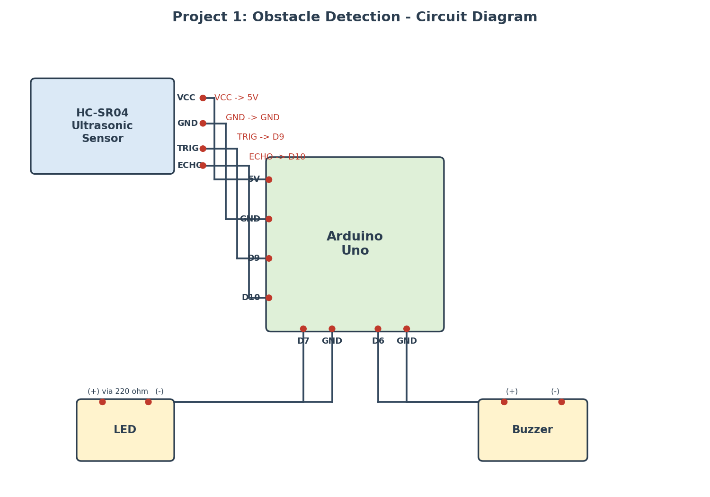

# Project 2: LiDAR Mapping (RPLiDAR A1)

## 1. Objective
Use a real 360° scanning LiDAR sensor to capture live distance
measurements all around the sensor and render them as a 2D point-cloud
map in real time — the core sensing step behind SLAM (Simultaneous
Localization and Mapping) used in autonomous robots.

## 2. Hardware Used
| Component               | Qty | Notes                                  |
|---------------------------|-----|------------------------------------------|
| RPLiDAR A1 (A1M8)          | 1   | 360° laser triangulation LiDAR, with USB adapter board |
| PC / Laptop (or Raspberry Pi) | 1 | Runs the Python plotting script       |
| USB cable (Micro-USB)      | 1   | Comes with the RPLiDAR adapter board   |

No Arduino or servo is required — the RPLiDAR A1 has its own internal
motor and spins/scans on its own once powered through the USB adapter.

## 3. Software Used
- **Python 3**
- `rplidar-roboticia` — driver library to talk to the RPLiDAR over serial
- `matplotlib` — live polar plotting
- `numpy` — array/angle handling

Install dependencies:
```bash
pip install rplidar-roboticia matplotlib numpy
```

## 4. Circuit / Connection Diagram



**Connection Table**

| RPLiDAR A1 | Connects to |
|------------|-------------|
| Sensor head 5-pin connector | USB adapter board (bundled with kit) |
| USB adapter board | USB port on PC / Raspberry Pi |

No manual wiring of individual pins is needed — the bundled adapter
board handles the 5V power, motor PWM control, and UART-to-USB
conversion internally.

## 5. Working Principle
1. The RPLiDAR A1 is a **laser triangulation** ranging system: it fires
   a modulated infrared laser and measures the reflection angle on an
   internal sensor to calculate distance, rather than timing an echo.
2. Once powered, its internal motor spins the optical core clockwise
   at roughly 5.5 Hz, scanning the full 360° around it.
3. During each rotation it takes up to ~8000 distance samples per
   second, giving an angular resolution of ≤1° at typical scan speed.
4. Each measurement is sent over the USB-UART bridge as a
   `(quality, angle, distance)` triplet.
5. The Python script uses the `rplidar` library's `iter_scans()`
   generator to collect each full 360° sweep as a list of these
   triplets, converts angle/distance into polar coordinates, and
   updates a live `matplotlib` polar scatter plot — producing a
   continuously refreshing top-down map of nearby surfaces and
   obstacles.

## 6. How to Run the Code
1. Plug the RPLiDAR A1's USB adapter into your PC (or Raspberry Pi).
2. Note which serial port it appears as:
   - Windows: check **Device Manager > Ports (COM & LPT)**, e.g. `COM5`
   - Linux/Raspberry Pi: usually `/dev/ttyUSB0`
3. Install the Python dependencies:
   ```bash
   pip install rplidar-roboticia matplotlib numpy
   ```
4. Run the script with your port:
   ```bash
   python lidar_mapping.py COM5
   ```
5. The LiDAR's motor will spin up and a live polar plot window will
   open, showing points around the sensor updating in real time.
6. Press `Ctrl+C` in the terminal to stop the scan and safely stop
   the motor.

## 7. Results
- The RPLiDAR produces a genuine 360° top-down point-cloud of the
  room/area around it, unlike a single-point sensor.
- Walls, furniture, and moving objects (like a hand passing by) show
  up as clusters of points at consistent radii and angles.
- Effective indoor range is roughly up to 6–12 m depending on surface
  reflectivity and lighting.

## 8. Future Improvements
- Feed the scan data into a **SLAM library** (e.g., `breezySLAM`,
  `Cartographer`, or ROS `slam_toolbox`) to build a persistent
  occupancy-grid map instead of a live single-frame scan.
- Combine with wheel **odometry** on a mobile robot so the map
  updates as the robot moves through a space, not just from one
  fixed spot.
- Log scans to CSV/PCD files for offline map stitching and analysis.
- Add **obstacle clustering** (e.g., DBSCAN) to identify distinct
  objects rather than raw scan points.
- Mount the RPLiDAR on a rover chassis for full autonomous
  navigation and obstacle avoidance.
